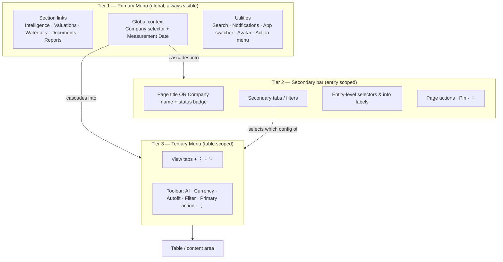
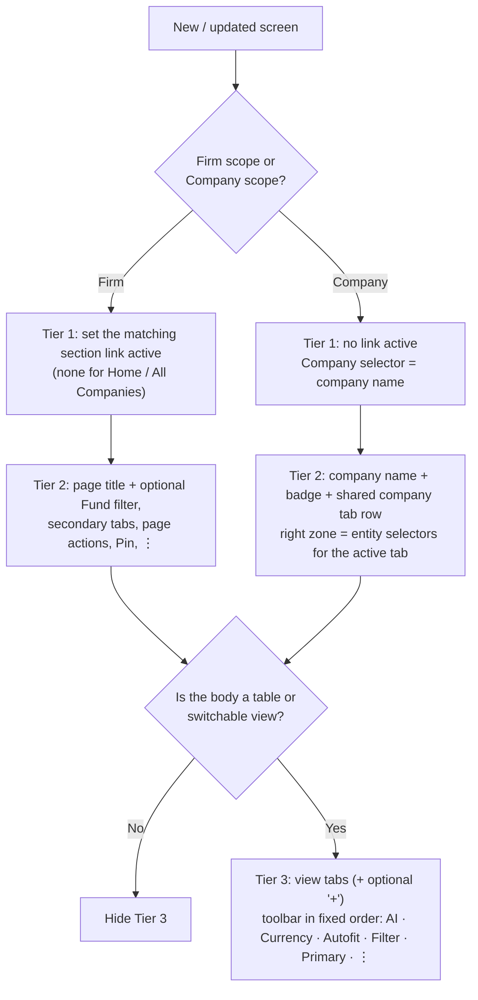

# Scalar Navigation — 3-Tier System

> **Audience:** Engineers and AI coding agents implementing or modifying screens in the Scalar product.
> **Source of truth:** Figma file `New-Navigation` (`nqqghejThUYeSXA9CgzLEu`), page **👁️ Global view Documentation** (`84:61868`).
> **Status:** Living spec. Items marked **⚠️ Open** are not yet decided by Design — do not invent behaviour for them; raise them in the PR.

---

## 1. TL;DR for agents

1. Every authenticated screen renders the same vertical stack: **Tier 1 (Primary) → Tier 2 (Secondary) → Tier 3 (Tertiary) → content**.
2. **Tier 1 never changes structure.** Only its *state* changes (active nav item, Company selector value, Measurement Date value).
3. **Tier 2 is scoped to the entity** (Firm or Company) and is reconfigured per page.
4. **Tier 3 is scoped to the table/view** currently on screen and is reconfigured per Tier 2 tab.
5. Tiers 2 and 3 are **optional per screen** — hide them entirely rather than rendering empty bars.
6. **Never hand-build a nav bar.** Compose from the shared components listed in §6. Add a new screen by adding a *configuration*, not new markup.
7. All data below Tier 1 is a function of two global values: **Company scope** and **Measurement Date**. Read them from shared context; never store a local copy.

---

## 2. Mental model

The three tiers form a deliberate narrowing of scope. Each level answers a different question:

| Tier | Component | Question it answers | Scope | Changes when… |
|---|---|---|---|---|
| 1 | `Primary Menu` | *Where am I in the product, and what context am I looking at?* | Global | Never structurally. Only state updates. |
| 2 | `Company info` (Secondary bar) | *Which entity am I working on, and which area of it?* | Page / entity | User navigates to a different page or Tier 2 tab |
| 3 | `Tertiary Menu` | *Which table/view am I in, and what can I do to it?* | Table / view | User switches between Tier 3 tabs within a page |

**Core design contract:** set context at the top, then work with confidence that every table, metric and sub-view below reflects exactly that context.



---

## 3. Layout anatomy

All three bars are horizontal auto-layout rows with **space-between** distribution: navigation on the left, actions/controls on the right.

| Tier | Height | Horizontal extent | Padding (T/R/B/L) | Item gap | Background token | Fallback hex |
|---|---|---|---|---|---|---|
| 1 | **48px** | Full bleed (1440 in design) | 8 / 16 / 8 / 16 | 8 | `Brand/700` | `#02539A` |
| 2 | **32px** | Inset 16px each side (1408 in design) | 0 / 8 / 0 / 8 | 8 | `Neutral/White` | `#FFFFFF` |
| 3 | **40px** | Inset 16px each side (1408 in design) | 4 / 4 / 4 / 4 | — (space-between) | `Neutral/100` | `#F1F5F9` |

Total chrome height by configuration:

| Configuration | Height |
|---|---|
| Tier 1 only | 48px |
| Tier 1 + 2 | 80px |
| Tier 1 + 2 + 3 | 120px |

Layout rules:

- Tiers stack with **no gap** between them.
- Tier 2 and Tier 3 share the same 16px inset so their left edges align.
- Interactive items inside all three tiers are **32px tall**; small toolbar controls in Tier 3 and buttons in Tier 2 are **24px**.
- Always use the design tokens above; the hex values are for reference only.

```
┌──────────────────────────────────────────────────────────────────────────────┐
│ T1 48px  [Logo] Intelligence Valuations … │ [Companies▾] [Meas. Date ▾] │ [Search][🔔][⇄][👤][⋮] │
└──────────────────────────────────────────────────────────────────────────────┘
  ┌──────────────────────────────────────────────────────────────────────────┐
  │ T2 32px  Title/Company [Badge] [Filter▾] Tab Tab Tab … │ [Info][Info][Sel▾] [Btn] [📌] [⋮] │
  ├──────────────────────────────────────────────────────────────────────────┤
  │ T3 40px  [View ⋮] View View … [+]          │ [✦AI] [USD|($)K] [⤢] [⫶] [Save ▾] [⋮] │
  └──────────────────────────────────────────────────────────────────────────┘
  Content…
```

---

## 4. Tier 1 — Primary Menu

Persistent across the entire product. Hosts section navigation, the two global context filters, and user utilities.

### 4.1 Zones (left → right)

**Left — Main container**

| Element | Component | Notes |
|---|---|---|
| Firm logo | `Firm Logo` (image) | Reflects the active firm. |
| Section links | `Main-Menu-horizontal-item` ×5 | Fixed order: **Intelligence, Valuations, Waterfalls, Documents, Reports**. |

**Center-left — Global context ("master filters")**

| Element | Component | Values | Behaviour |
|---|---|---|---|
| Company selector | `Company Dropdown` (store icon + label + chevron) | `Companies` (portfolio/firm scope) **or** a specific company name, e.g. `Apple Inc.` | Sets the entity scope for everything below. |
| Measurement Date | `Date Selector` (label "Measurement Date" + value + chevron) | A date (`01/17/2024`), `Most Recent`, or `Most Recent <date>` (e.g. `Most Recent 12/31/2025`) | Anchors all financial data, valuations and comparisons to a reporting period. |

**Right — User controls**

| Element | Component | Notes |
|---|---|---|
| Global search | `Search Bar` | Placeholder `Search (Ctrl+K on Windows)`. Keyboard shortcut opens it from anywhere. Searches/navigates anything the user can access. |
| Notifications | `Notification Icon` | Shows a numeric counter badge when unread > 0. |
| App switcher | `Tool-switch` | Two-state toggle: **Portfolio Valuations** ↔ **Workboard**. Render only when `user.is_staff === true`. |
| Avatar | `Avatar` | User profile image. |
| Action menu | `User Menu Icon` (⋮) | Opens the Global Action Menu (§4.3). |

### 4.2 States

`Main-Menu-horizontal-item` variants: `State = Default | hover | active`.

| Rule | Detail |
|---|---|
| Exactly **zero or one** section link is `active`. | The link that matches the current firm-level page. |
| Active styling | Bold white label with an underline indicator. |
| **No link is active** when… | The user is on the Homepage Dashboard, on **All Companies**, or inside **any Company page** (Company selector ≠ `Companies`). |

### 4.3 Global Action Menu (⋮) and sub-menus

Global Action Menu (232px wide, items 24px tall, dividers between groups):

1. **Firm group** — current firm name (with firm logo), Switch Firm, User Management, Comp Groups, Audit Logs, Firm Settings
2. *divider*
3. **User group** — user name (with avatar), Account Settings, Feedback
4. *divider*
5. **Sign Out**

Sub-menus (200px wide):

- **Switch Firm →** searchable list (`Find a Firm` input), list of firms the user can access, `Add New Firm` button at the bottom. Only show *Switch Firm* when the user has access to more than one firm.
- **Firm Settings →** Firm Profile, Single Sign-On, SCIM.

### 4.4 Behaviour contract

- **Measurement Date persists** across every navigation: switching section, switching company, switching tabs. It only changes when the user changes it.
- **Company selector drives the scope of Tier 2.** `Companies` → firm-level pages. A specific company → company pages (§5.3).
- Changing either master filter must **re-fetch/re-derive all data on screen** without resetting the user's current Tier 2/Tier 3 position where that position still exists.
- Tier 1 structure is fixed. Do not add, remove or reorder items for a specific page.

---

## 5. Tier 2 — Secondary bar (`Company info`)

A dynamic layer that reconfigures entirely when the user navigates. It surfaces the sub-areas of the current entity and the controls that apply to the **whole entity**.

### 5.1 Zones

**Left — `Content`** (in this order; each slot is optional except the title)

| Slot | Component | Notes |
|---|---|---|
| Title | Text (`Company Name` layer) | Page name on firm pages (e.g. `Valuations`); company name on company pages (e.g. `Apple Inc.`). |
| Status badge | `Badge` | Company pages only. Shows record status, e.g. `Draft`. |
| Fund filter | `Filter dropdown` | `Filter by Fund`. Firm-level data pages only. |
| Secondary tabs | `Secondary Menu` ×n | Tab row. Variants `Property 1 = Default | Hover | Active`. Exactly one `Active` when tabs are present. |

**Right — `Selectors` / actions**

| Slot | Component | Notes |
|---|---|---|
| Info labels | `Information Label` | Read-only KPI (label + value) or selectable value with a dropdown/calendar. See §5.4. |
| Page actions | `Button` (Size S) | Page-level primary/secondary actions (e.g. *Upload Document*). |
| Pin | `Pin Icon` in `Pin Container` | Firm-level pages. **⚠️ Open:** pin behaviour is not specified yet. |
| Overflow | `Meatball menu` (⋮) | Entity-level management actions. Always the right-most element when present. |

### 5.2 Firm-level pages (Company selector = `Companies`)

Pattern: **page title on the left, page controls on the right.**

| Page | Left zone | Right zone |
|---|---|---|
| Intelligence | Title · `Filter by Fund` · tabs **Summaries**, **Schedule of Investments** | Pin |
| Valuations | Title · `Filter by Fund` · tab **Summaries** | Pin |
| Waterfalls (Prism Phase 2) | Title · `Filter by Fund` | Pin |
| Waterfalls (Prism Phase 1) | Title | Pin |
| Documents | Title | **Request Document** (Secondary, leading icon) · **Upload Document** (Primary, leading icon) · **Request Information** (Positive) · Pin · ⋮ |
| Reports | Title | **Request Report** (Secondary) · **Create Report** (Primary) · Pin · ⋮ |
| All Companies | Title · `Filter by Fund` | **⚠️ Open:** currently shows Request Report / Create Report (looks copied from Reports) · Pin · ⋮ |
| Homepage Dashboard | *Tier 2 hidden* | — |

### 5.3 Company-level pages (Company selector = a specific company)

Pattern: **company name + badge + a shared tab row on the left, entity selectors on the right.**

The tab row is identical on every company page and is a shared component:

**Summary · Financials · Cap Table · Valuations · Waterfall · Documentation**

The **same tab row produces different right-zone controls per tab:**

| Active tab | Right-zone controls |
|---|---|
| *(none — Company landing)* | Equity Value · Unrealized Firm Total · Valuation Version ▾ · ⋮ — **⚠️ Open:** confirm whether landing should default to Summary. |
| Summary | Equity Value · Unrealized Firm Total · Valuation Version ▾ · ⋮ |
| Financials | Financials Date (calendar) · Financials Version ▾ · ⋮ |
| Cap Table | Cap Table version ▾ (e.g. `Primary Cap Table`) · ⋮ |
| Valuations | Equity Value · Unrealized Firm Total · Valuation Version ▾ · ⋮ |
| Waterfall | Equity Value · Unrealized Firm Total · Valuation Version ▾ · ⋮ |
| Documentation | **⚠️ Open:** not designed yet. |

### 5.4 `Information Label` usage

| Mode | Shape | Value colour | Example |
|---|---|---|---|
| KPI (read-only) | `Label  Value` | Positive / green | `Equity Value $34,560,000` |
| Selectable value | `Label  Value ▾` or `Label  Value 📅` | Link / blue | `Financials Version Primary Financial ▾` |
| Version only | `Value ▾` (no label) | Link / blue | `Valuation Version - 12/31/2026 ▾` |

Selectable info labels are **entity-wide**: changing them changes every table in Tier 3 for that company.

---

## 6. Tier 3 — Tertiary Menu

Sits directly above the data it governs. The most contextual tier: it changes by page **and** by which Tier 2 tab is active.

### 6.1 Zones

**Left — `Menu items` (view tabs)**

| Element | Component | Behaviour |
|---|---|---|
| View tabs | `Tertiary Menu` item. Variants `Property 1 = Default | Hover | Active`; boolean `Drop-down` | Exactly one `Active`. The active tab is shown with a filled background and a **⋮ kebab** (`Drop-down = true`) for view management: rename, reorder, duplicate. Inactive tabs show no kebab. |
| Add view | `Button_Icon` with `Add` icon (+) | Optional. Adds a new sub-view/tab. Its meaning is page-specific (see §6.3). |

**Right — `Actions Container` (toolbar)** — fixed order, left to right. Omit what the page doesn't support; never reorder.

| # | Control | Component | Rule |
|---|---|---|---|
| 1 | AI assistant | `AI tool` (`AI-trigger` / `AI-input-field`) | **Always present** when Tier 3 is visible. Scoped to the current table. Detailed behaviour defined separately. |
| 2 | Currency & units | `Currency Selector` (`USD` + `($) Thousands`) | Show on any page with currency/number formatting. **Applies to every table on the page** — remove per-table currency selectors. |
| 3 | Autofit | `Button_Icon` (fit_screen) | Adjusts row density/column fit. Show only if the table supports it. |
| 4 | Filter | `Button_Icon` (Filter) | Opens column-level filtering for the current table. |
| 5 | Primary action | `Button` (Size S) | Changes per context (§6.3). |
| 6 | Overflow | `Meatball menu` (⋮) | Table-level management options. |

### 6.2 Visibility rule

Show Tier 3 **only when the page body is a table or switchable view**. Pages with document/report lists or dashboards hide it entirely (Documents, Reports, All Companies, Homepage, Company landing).

### 6.3 Configuration by page

| Page | View tabs (first = default active) | "+" adds… | Toolbar |
|---|---|---|---|
| Intelligence | Firm Summary, custom views (Custom View 1…n) | a new custom View | AI · Currency · Autofit · Filter · ⋮ |
| Valuations (firm) | Valuation Summary | a new view on the Valuations page | AI · Currency · Autofit · Filter · **Bulk Actions** (Secondary, trailing icon) |
| Waterfalls (firm, Phase 2) | Waterfalls Summary | ⚠️ Open | AI · Autofit · Filter · **Save Notes & Documents** |
| Company › Summary | Summary, Company Overview, At a Glance | ⚠️ Open | AI · Currency |
| Company › Financials | Income Statement, Balance Sheet, KPIs | *(no +)* | AI · Currency · Autofit · Filter · **Save ▾** |
| Company › Cap Table | Cap Table, Fund Ownership, Breakpoint Analysis, Cash Flow Ledger | *(no +)* | AI · Currency · Autofit · Filter · **Save ▾** |
| Company › Valuations | Valuations Summary, GPC, GT, Backsolve, Future Exit, Discounted Cash Flow, External Valuation | an additional valuation approach | AI · Currency · Autofit · Filter · **Save ▾** |
| Company › Waterfall | Waterfalls Summary | ⚠️ Open | AI · Currency · Autofit · Filter · **Save Notes & Documents** |

Primary action summary:

| Primary action | Where |
|---|---|
| `Save ▾` (Primary/positive, with dropdown) | Company Valuations, Cap Table, Financials |
| `Save Notes & Documents ▾` | Waterfalls (firm and company) |
| `Bulk Actions` (Secondary, trailing icon) | Firm-level Valuations |
| *(none)* | Intelligence, Company Summary |

---

## 7. Screen configuration matrix

Quick reference of which tiers render per screen, and the Tier 1 state.

| Screen | Tier 1 active link | Company selector | Tier 2 | Tier 3 |
|---|---|---|---|---|
| Homepage Dashboard | — | Companies | ✕ | ✕ |
| Intelligence | Intelligence | Companies | ✓ | ✓ |
| Valuations | Valuations | Companies | ✓ | ✓ |
| Waterfalls (Phase 1) | Waterfalls | Companies | ✓ | ✕ |
| Waterfalls (Phase 2) | Waterfalls | Companies | ✓ | ✓ |
| Documents | Documents | Companies | ✓ | ✕ |
| Reports | Reports | Companies | ✓ | ✕ |
| All Companies | — | Companies | ✓ | ✕ |
| Company landing | — | *Company name* | ✓ | ✕ |
| Company › Summary / Financials / Cap Table / Valuations / Waterfall | — | *Company name* | ✓ | ✓ |

---

## 8. Implementing a new screen or updating an existing one

### 8.1 Decision flow



### 8.2 Where does my new element go?

| If the element… | Put it in | Example |
|---|---|---|
| Changes context for the **whole product** | Tier 1 — **requires Design approval**; Tier 1 is fixed | — |
| Applies to the **whole entity** (all tables of a firm page or of a company) | Tier 2, right zone | Valuation Version, Financials Date |
| Narrows a firm-level page by fund | Tier 2, `Filter dropdown` next to title | Filter by Fund |
| Is a page-level create/request action with no table | Tier 2, right zone `Button` | Upload Document |
| Switches between **areas** of an entity | Tier 2 tab | Cap Table |
| Switches between **tables/views** inside an area | Tier 3 view tab | Balance Sheet |
| Affects only the **current table** | Tier 3 toolbar | Filter, Autofit |
| Commits changes to the current table | Tier 3 primary action | Save ▾ |
| Is a rarely used management action | The ⋮ of the tier whose scope it affects | Rename view → Tier 3 ⋮ |

### 8.3 Rules

**Do**

- Reuse the shared components. Toolbar controls must be identical everywhere so tools are standardized across the app.
- Keep toolbar order fixed; omit unsupported controls rather than leaving gaps.
- Keep exactly one active item in each tab row that is present.
- Keep the right-most slot of any bar for ⋮ when it exists.
- Preserve Measurement Date and Company scope across all navigation.

**Don't**

- Don't add page-specific items to Tier 1.
- Don't put table-level controls in Tier 2, or entity-level selectors in Tier 3.
- Don't render per-table currency selectors when the Tier 3 Currency Selector is present.
- Don't render an empty Tier 2 or Tier 3 bar; hide the tier.
- Don't remove the AI tool from a visible Tier 3.

### 8.4 Suggested configuration contract (proposed)

The nav should be data-driven so new screens are added by configuration. The interface below is a **proposal** for the Prism code layer; adapt names to the existing codebase.

```ts
type Scope = 'firm' | 'company';

interface NavContext {
  scope: Scope;                 // derived from Company selector
  companyId?: string;           // set when scope === 'company'
  measurementDate: string | 'most-recent';
}

interface Tier1State {
  activeSection?: 'intelligence' | 'valuations' | 'waterfalls' | 'documents' | 'reports';
}

interface Tier2Config {
  title: string;                // page title or company name
  badge?: { label: string };    // company pages only
  fundFilter?: boolean;
  tabs?: { id: string; label: string; href: string }[];
  activeTabId?: string;
  infoLabels?: InfoLabelConfig[];
  actions?: ButtonConfig[];
  showPin?: boolean;
  overflowMenu?: MenuItem[];
}

interface Tier3Config {
  views: { id: string; label: string }[];
  activeViewId: string;
  canAddView?: boolean;         // renders "+"
  viewMenu?: MenuItem[];        // kebab on the active view
  toolbar: {
    ai: true;                   // always on when Tier 3 is visible
    currency?: boolean;
    autofit?: boolean;
    filter?: boolean;
    primaryAction?: ButtonConfig;
    overflowMenu?: MenuItem[];
  };
}

interface ScreenNavConfig {
  tier1: Tier1State;
  tier2?: Tier2Config;          // undefined → tier hidden
  tier3?: Tier3Config;          // undefined → tier hidden
}
```

---

## 9. Component inventory (Figma)

All components are published from the Scalar library and consumed as remote instances in the navigation file.

| Tier | Figma component | Type | Key properties |
|---|---|---|---|
| 1 | `Primary Menu` | Component | key `35ef7d3e0ebe1c9062e6c15bc525203b152cd8f9` |
| 1 | `Main-Menu-horizontal-item` | Component set | `State`: Default / hover / active · `Lable` (text) · `Drop-down` (bool) · `Menu Icon` (swap) |
| 1 | `Company Dropdown`, `Date Selector`, `Search Bar`, `Notification Icon`, `Tool-switch`, `Avatar` | Nested instances | — |
| 2 | `Secondary Menu` | Component set | `Property 1`: Default / Hover / Active · `Menu label` (text) · `Active item` (bool) |
| 2 | `Filter dropdown` | Component | key `611eed47808884422f72578300bbd9a37b381511` |
| 2 | `Badge` | Component | key `96b5b00d96f4fa2f9aca153e942d2a750961efc6` · `Label`, `Icon` |
| 2 | `Information Label` | Component | key `aa2f15d032c5341285de2d83ac032009c866b008` · `Label`, `Amount`, `Long Value`, `Has drop down`, `L1`/`L2`/`L3` |
| 3 | `Tertiary Menu` (bar) | Component | key `0ee781df6d9dd70b0c7d61819dfd89db26d8e9b4` |
| 3 | `Tertiary Menu` (item) | Component set | `Property 1`: Default / Hover / Active · `Lable` (text) · `Drop-down` (bool) · `Menu Icon` (swap) |
| 3 | `AI tool` | Component set | `Property 1`: AI-trigger / AI-input-field |
| 3 | `Currency Selector` | Component | key `4943d639cc1cf954d68fb797fc880f13ae37b72f` |
| 2/3 | `Button`, `Button_Icon`, `Meatball menu` | SDS components | Size S, Style Primary / Secondary, Type Main / Positive |

### Figma reference frames (file `nqqghejThUYeSXA9CgzLEu`)

| Screen | Node ID |
|---|---|
| Homepage Dashboard | `84:62377` |
| Intelligence | `84:62378` |
| Valuations | `84:62557` |
| Waterfalls – Prism Phase 1 | `425:5179` |
| Waterfalls – Prism Phase 2 | `100:71456` |
| Documents | `100:72719` |
| Reports | `100:73628` |
| All Companies | `102:74085` |
| Company Page (landing) | `84:62915` |
| Company Summary | `116:75308` |
| Company Financials | `116:75709` |
| Company Cap Table | `116:79242` |
| Company Valuations | `116:85690` |
| Company Waterfalls | `123:86325` |
| Global Action Menu | `347:4347` |
| Firm dropdown (Switch Firm) | `347:4546` |
| Firm Settings dropdown | `347:4672` |

---

## 10. Open questions and known Figma inconsistencies

Resolve these with Design before implementing the affected behaviour.

**Behaviour not yet defined**

1. Firm-level Tier 2 controls for Intelligence, Valuations, Waterfalls, Documents and Reports are marked *TBD* in the written spec; the table in §5.2 reflects the current frames only.
2. Pin icon behaviour on firm-level Tier 2.
3. Company › Documentation tab: no frame exists.
4. Company landing (no tab active): confirm whether it should redirect to Summary.
5. All Companies right-zone actions duplicate Reports (Request Report / Create Report).
6. What "+" adds on Company › Summary and on Waterfalls.
7. AI tool behaviour (to be defined separately).

**Spec text vs. frames**

8. Global Action Menu: the frames include **Audit Logs**, **Account Settings** and **Feedback**, which the written Tier 1 spec doesn't list. Frames are treated as current here.
9. Tier 3 written spec lists Bulk Actions "with ⋮"; the frame shows a trailing chevron icon.

**File hygiene (Design system)**

10. Firm-level frames contain a copy of the company tab row with `opacity: 0` inside `Company info › Content`. It is invisible but still in the layer tree and in exports — agents reading layers may mistake it for real tabs. Recommend deleting.
11. `Secondary Menu` has both a `Property 1 = Active` variant and an unused `Active item` boolean. Use the variant; consider removing the boolean.
12. The `Button` component set reports errors when reading its properties on some instances (e.g. *Save Notes & Documents*). Recommend fixing in the library.
13. Typos in property/layer names and content: `Lable` (Tier 1 and Tier 3 items), `Dorop_down`, `Cash Flow Leadger`, `Primary FInancial`. Use the corrected spellings in code.
